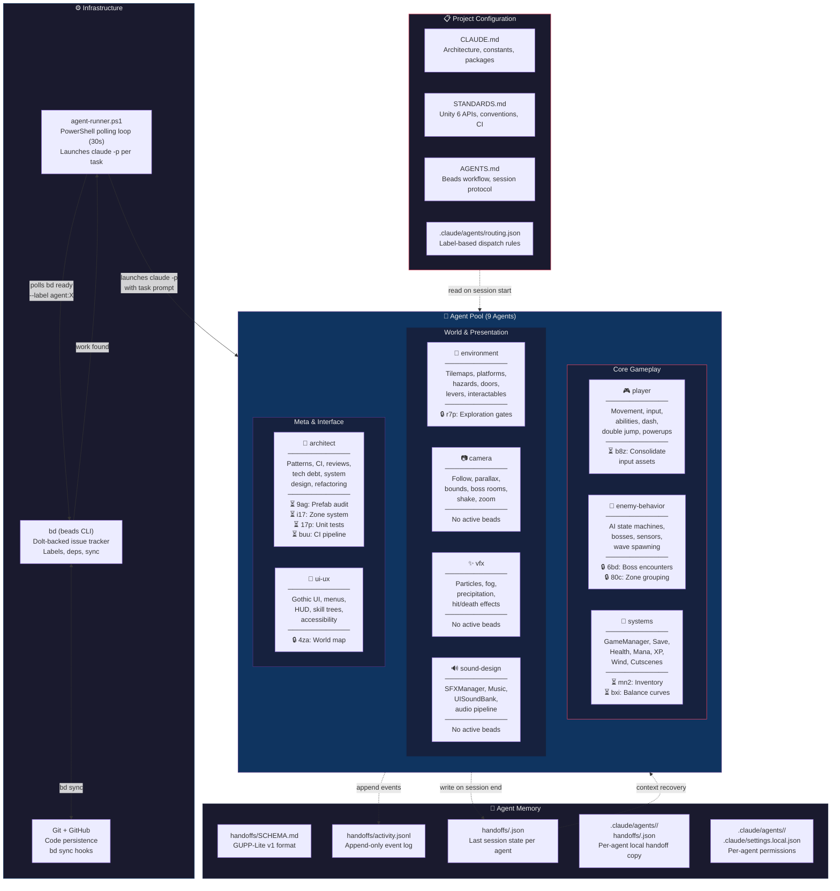
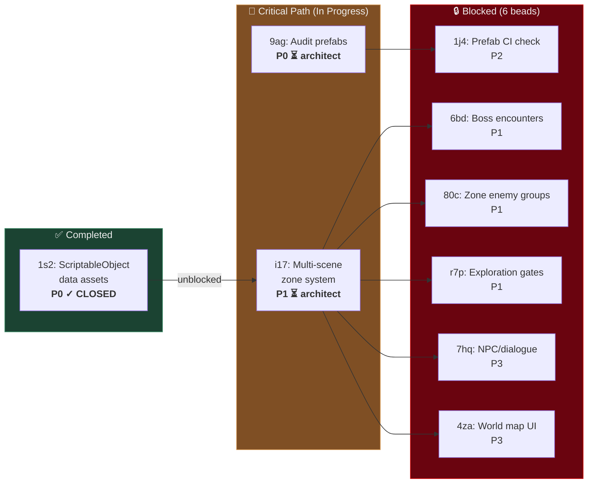
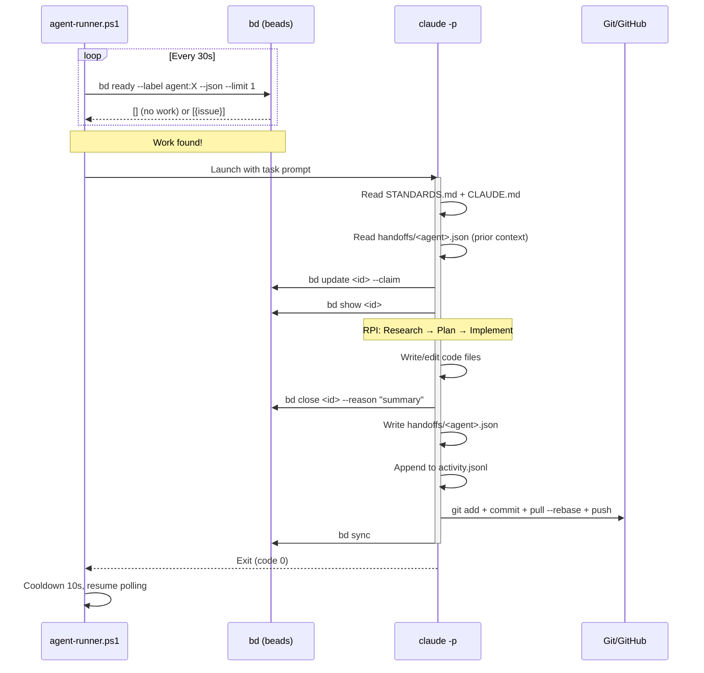

# Agent Architecture Overview

## System Architecture

## Current Blocking Chain

## Agent Session Lifecycle

## Project Stats Snapshot

| Metric | Count |
|--------|-------|
| Total beads | 62 |
| Closed | 49 |
| In Progress | 7 |
| Open (unblocked) | 0 |
| Blocked | 6 |
| Ready to work | 0 |
| Agents with handoffs | 3 (vfx, systems, sound-design) |

**Legend:** ⏳ In Progress | 🔒 Blocked | ✅ Completed
